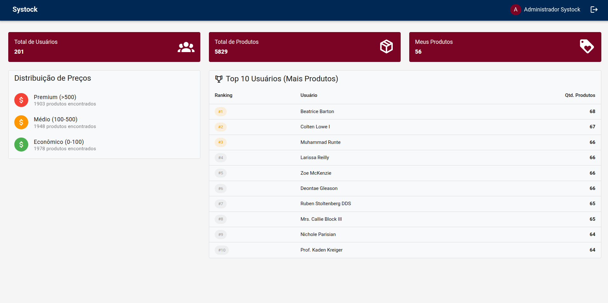
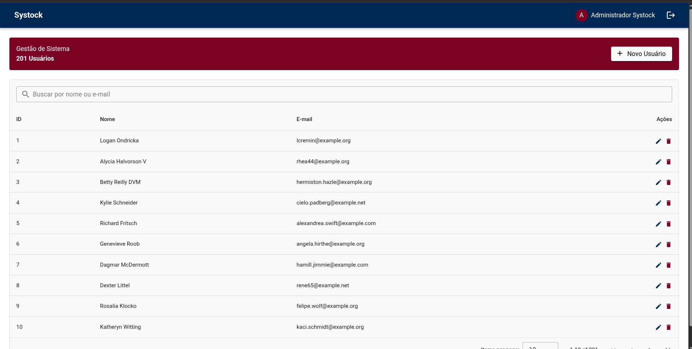
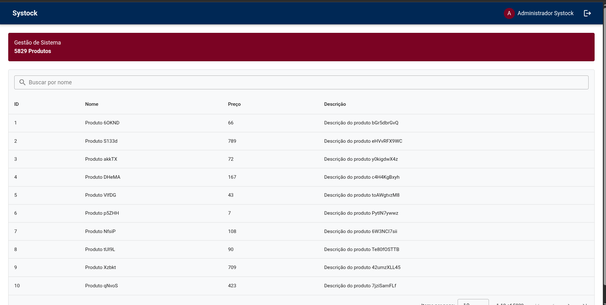
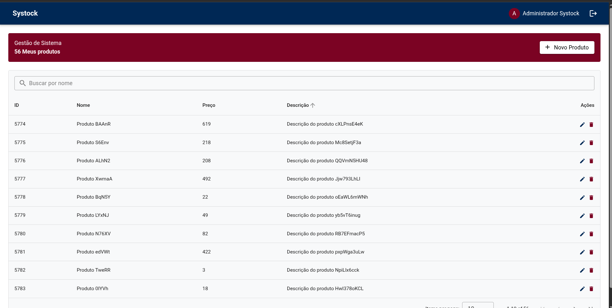

# 📦 Systock - Full Stack Management System

[](https://laravel.com)
[](https://vuejs.org)
[](https://www.docker.com)
[](https://phpunit.de)

Sistema de gerenciamento de usuários e produtos desenvolvido como teste técnico, focado em alta disponibilidade, código limpo e escalabilidade.

## 📸 Preview do Sistema

Aqui estão algumas capturas de tela do **Systock** em funcionamento:

### Dashboard



### Gerenciamento de Usuários



### Gerenciamento de Produtos



### Meus Produtos (Relacionamento 1:N)



## 🚀 Tecnologias Utilizadas

### Core

- **Back-end:** Laravel 11 (PHP 8.3)
- **Front-end:** Vue.js 3 + Vuetify 3 + Vite
- **Banco de Dados:** PostgreSQL 15
- **Autenticação:** Laravel Sanctum (SPA Authentication)

### Infraestrutura & Qualidade

- **Docker & Docker Compose:** Orquestração completa da stack (App, Web, DB, pgAdmin).
- **Nginx:** Servidor web para API e Proxy para o SPA.
- **PHPUnit:** Testes de integração e feature com SQLite em memória para performance.
- **Clean Architecture:** Separação clara entre Models, Controllers e Services.

---

## 🛠️ Setup do Projeto

O projeto está totalmente dockerizado para garantir que rode em qualquer máquina sem necessidade de instalar dependências locais.

### 1. Requisitos

- Docker & Docker Compose instalados.
- Git.

### 2. Instalação e Execução

Clone o repositório e entre na pasta:

```bash
git clone [https://github.com/JonatasRodriguesReis/systock-challenge.git](https://github.com/JonatasRodriguesReis/systock-challenge.git)
cd systock-challenge
```

Execute o comando abaixo para garantir que o script de entrada seja executável:

```bash
chmod +x backend/docker/entrypoint.sh
```

Suba a stack completa

```bash
docker-compose up -d --build
```

Nota: O sistema executa automaticamente composer install, npm install, migrations e seeders durante o startup do container.

### 3. Acesso aos Serviços

    * Frontend: http://localhost:3000

    * Backend API: http://localhost:8000

    * pgAdmin: http://localhost:15432

    * User: admin@admin.com | Pass: admin

### 4. Credenciais de Teste (Seed)

    * Usuário Admin: admin@systock.com.br

    * Senha: admin123

## 🧪 Testes Automatizados

A suíte de testes cobre as operações críticas de CRUD, autenticação e filtros de busca (Sort, Search e Pagination).

Para rodar os testes dentro do container:

```bash
docker exec -it systock-api php artisan test
```

## 📡 API Endpoints (Principais)

| Método   | Endpoint             | Descrição                                  |
| :------- | :------------------- | :----------------------------------------- |
| `POST`   | `/api/login`         | Autenticação e criação de sessão           |
| `GET`    | `/api/usuarios`      | Listagem com Paginação/Filtros/Sort        |
| `POST`   | `/api/usuarios`      | Cadastro de novo usuário                   |
| `PUT`    | `/api/usuarios/{id}` | Edição de usuário                          |
| `DELETE` | `/api/usuarios/{id}` | Exclusão de usuário                        |
| `GET`    | `/api/produtos`      | Listagem geral de produtos                 |
| `GET`    | `/api/relatorio-sql` | Relatório em SQL Puro (Requisito Opcional) |

## 🔐 Segurança e Regras de Negócio (Authorization)

O sistema implementa camadas de segurança para garantir a integridade dos dados:

- **Propriedade de Produtos:** Foi implementada uma lógica de **Authorization** onde um produto só pode ser atualizado ou removido se o usuário autenticado for o proprietário (dono) do registro. Isso impede que usuários manipulem inventários alheios.
- **Gestão de Usuários:** Atualmente, qualquer usuário autenticado pode gerenciar a lista de usuários.
- **Potencial de Melhoria (Roadmap):** Como evolução da arquitetura, planeja-se a implementação de **Roles (RBAC)**, permitindo que apenas usuários com perfil `Admin` tenham permissões para atualizar ou remover outros usuários do sistema.

---

## ✅ Checklist de Requisitos

- [x] **CRUD completo de Usuários e Produtos:** Operações de criação, leitura, atualização e deleção.
- [x] **Validação de Dados:** CPF (validação de formato), Email único e Senha (mínimo de 6 caracteres).
- [x] **Interface Responsiva:** Desenvolvida com Vuejs 3 e Vuetify 4 para adaptação em diferentes dispositivos.
- [x] **Relacionamento 1:N:** Estrutura de banco de dados e Eloquent ligando Usuário a múltiplos Produtos.
- [x] **Validação de dados:**: No back-end com mensagens claras em caso de erro.
- [x] **Respostas das requests:** : As respostas são em JSON com status HTTP apropriado.
- [x] **Migrations e Seeders:**: Utilização das migrations e Seeders no setup da API.
- [x] **Axios no front-end:**: Utilização do Axios para as chamadas HTTP no frontend.
- [x] **Dockerização:** Orquestração completa de containers (App, Web, DB, pgAdmin) via Docker Compose.
- [x] **Testes Automatizados:** Suíte de Feature Tests utilizando PHPUnit.
- [x] **Autenticação:** Proteção de rotas e persistência de sessão com Laravel Sanctum.
- [x] **Filtros Avançados:** Lógica de busca, ordenação e paginação processada integralmente no Server-side.
- [x] **Relatório SQL:** Rota dedicada utilizando Raw Queries (`DB::select`) para máxima performance e demonstração de conhecimento em SQL.
- [x] **Arquivo de consultas:** Criação das 3 consultas no arquivo `backend/database/consultas.sql`.

---

## 🧠 Avaliação de SQL

As queries solicitadas para o desafio técnico (como listagem de usuários com mais produtos e produtos mais caros) foram documentadas para avaliação no arquivo:

📂 `backend/database/consultas.sql`

---

**Desenvolvido por Jonatas Reis.**
